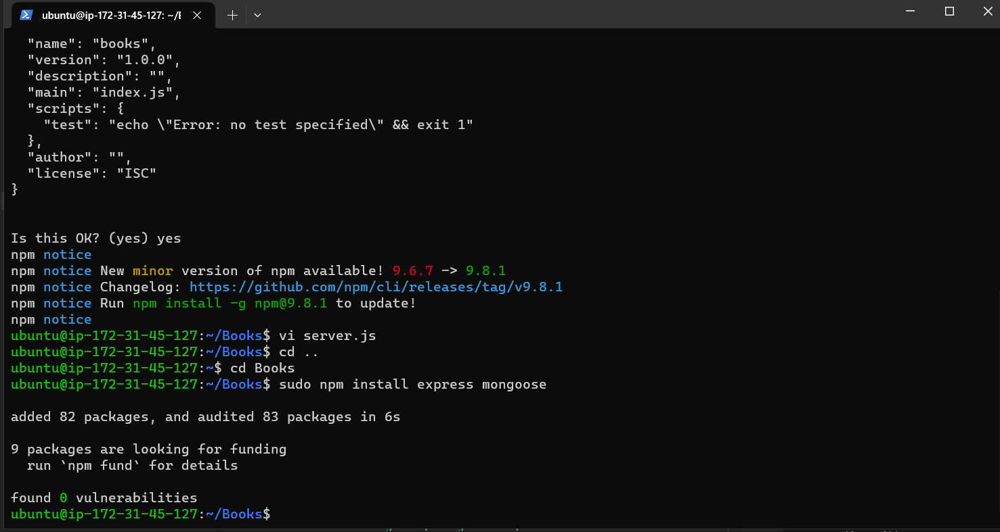

### MEAN STACK DEPLOYMENT TO UBUNTU IN AWS

## Step 1: Install NodeJs

*Update Ubuntu*

`sudo apt update && sudo apt upgrade -y`


*add certificates*

`sudo apt -y install curl dirmngr apt-transport-https lsb-release ca-certificates`

`curl -sL https://deb.nodesource.com/setup_18.x | sudo -E bash -`

# Install NodeJS

`sudo apt install -y nodejs`

## Step 2: Install MongoDB

*MongoDB stores data in flexible, JSON-like documents. Fields in a database can vary from document to document and data structure can be changed over time*

*we are adding book records to MongoDB that contain book name, isbn number, author, and number of pages*

`sudo apt-key adv --keyserver hkp://keyserver.ubuntu.com:80 --recv 0C49F3730359A14518585931BC711F9BA15703C6`

`echo "deb [ arch=amd64 ] https://repo.mongodb.org/apt/ubuntu trusty/mongodb-org/3.4 multiverse" | sudo tee /etc/apt/sources.list.d/mongodb-org-3.4.list`


# Install MongoDB

`sudo apt-get install gnupg curl`


*mondoDB installation guide*

[mongodb ubuntu](https://www.mongodb.com/docs/manual/tutorial/install-mongodb-on-ubuntu/)

*check the version of the node installed and its status*

`node -v`
`sudo systemctl start mongod`
`sudo systemctl status mongod`


*Install npm – Node package manager.*

*please refer to the link below for installation of node js*


*Install body-parser package to help us process JSON files passed in requests to the server*

`sudo npm install body-parser`


*Create a folder named ‘Books’*

`mkdir Books && cd Books`

*In the Books directory, Initialize npm project*

`npm init`


*Add a file to it named server.js*

`sudo vi server.js`

*and paste*

```
{
  var express = require('express');
var bodyParser = require('body-parser');
var app = express();
app.use(express.static(__dirname + '/public'));
app.use(bodyParser.json());
require('./apps/routes')(app);
app.set('port', 3300);
app.listen(app.get('port'), function() {
    console.log('Server up: http://localhost:' + app.get('port'));
});

}
```


## Step 3: Install Express and set up routes to the server

*We  will use Mongoose package which provides a straight-forward, schema-based solution to model your application data. We will use Mongoose to establish a schema for the database to store data of our book register.*

`sudo npm install express mongoose`



*In ‘Books’ folder, create a folder named apps*

`mkdir apps && cd apps`

*Create a file named routes.js*

`sudo vi routes.js`

```
{
  const Book = require('./models/book');

module.exports = function(app){
  app.get('/book', function(req, res){
    Book.find({}).then(result => {
      res.json(result);
    }).catch(err => {
      console.error(err);
      res.status(500).send('An error occurred while retrieving books');
    });
  });

  app.post('/book', function(req, res){
    const book = new Book({
      name: req.body.name,
      isbn: req.body.isbn,
      author: req.body.author,
      pages: req.body.pages
    });
    book.save().then(result => {
      res.json({
        message: "Successfully added book",
        book: result
      });
    }).catch(err => {
      console.error(err);
      res.status(500).send('An error occurred while saving the book');
    });
  });

  app.delete("/book/:isbn", function(req, res){
    Book.findOneAndRemove(req.query).then(result => {
      res.json({
        message: "Successfully deleted the book",
        book: result
      });
    }).catch(err => {
      console.error(err);
      res.status(500).send('An error occurred while deleting the book');
    });
  });

  const path = require('path');
  app.get('*', function(req, res){
    res.sendFile(path.join(__dirname, 'public', 'index.html'));
  });
};
}
```
*In the ‘apps’ folder, create a folder named models*

`mkdir models && cd models`

`sudo vi books.js`

```
{
  var mongoose = require('mongoose');
var dbHost = 'mongodb://localhost:27017/test';
mongoose.connect(dbHost);
mongoose.connection;
mongoose.set('debug', true);
var bookSchema = mongoose.Schema( {
  name: String,
  isbn: {type: String, index: true},
  author: String,
  pages: Number
});
var Book = mongoose.model('Book', bookSchema);
module.exports = mongoose.model('Book', bookSchema);
}
```

## Step 4 – Access the routes with AngularJS

*we use AngularJS to connect our web page with Express and perform actions on our book register.Change the directory back to ‘Books’*

*Create a folder named public*

`mkdir public && cd public`

`sudo vi script.js`

```
{
  var app = angular.module('myApp', []);
app.controller('myCtrl', function($scope, $http) {
  $http( {
    method: 'GET',
    url: '/book'
  }).then(function successCallback(response) {
    $scope.books = response.data;
  }, function errorCallback(response) {
    console.log('Error: ' + response);
  });
  $scope.del_book = function(book) {
    $http( {
      method: 'DELETE',
      url: '/book/:isbn',
      params: {'isbn': book.isbn}
    }).then(function successCallback(response) {
      console.log(response);
    }, function errorCallback(response) {
      console.log('Error: ' + response);
    });
  };
  $scope.add_book = function() {
    var body = '{ "name": "' + $scope.Name + 
    '", "isbn": "' + $scope.Isbn +
    '", "author": "' + $scope.Author + 
    '", "pages": "' + $scope.Pages + '" }';
    $http({
      method: 'POST',
      url: '/book',
      data: body
    }).then(function successCallback(response) {
      console.log(response);
    }, function errorCallback(response) {
      console.log('Error: ' + response);
    });
  };
});
}
```

*In public folder, create a file named index.html;*

`sudo vi index.html`


```
{
  <!doctype html>
<html ng-app="myApp" ng-controller="myCtrl">
  <head>
    <script src="https://ajax.googleapis.com/ajax/libs/angularjs/1.6.4/angular.min.js"></script>
    <script src="script.js"></script>
  </head>
  <body>
    <div>
      <table>
        <tr>
          <td>Name:</td>
          <td><input type="text" ng-model="Name"></td>
        </tr>
        <tr>
          <td>Isbn:</td>
          <td><input type="text" ng-model="Isbn"></td>
        </tr>
        <tr>
          <td>Author:</td>
          <td><input type="text" ng-model="Author"></td>
        </tr>
        <tr>
          <td>Pages:</td>
          <td><input type="number" ng-model="Pages"></td>
        </tr>
      </table>
      <button ng-click="add_book()">Add</button>
    </div>
    <hr>
    <div>
      <table>
        <tr>
          <th>Name</th>
          <th>Isbn</th>
          <th>Author</th>
          <th>Pages</th>

        </tr>
        <tr ng-repeat="book in books">
          <td>{{book.name}}</td>
          <td>{{book.isbn}}</td>
          <td>{{book.author}}</td>
          <td>{{book.pages}}</td>

          <td><input type="button" value="Delete" data-ng-click="del_book(book)"></td>
        </tr>
      </table>
    </div>
  </body>
</html>
}
```

*Change the directory back up to Books*

*Start the server by running this command*

`node server.js`


*open port 3300 on the cloud instance*


   
